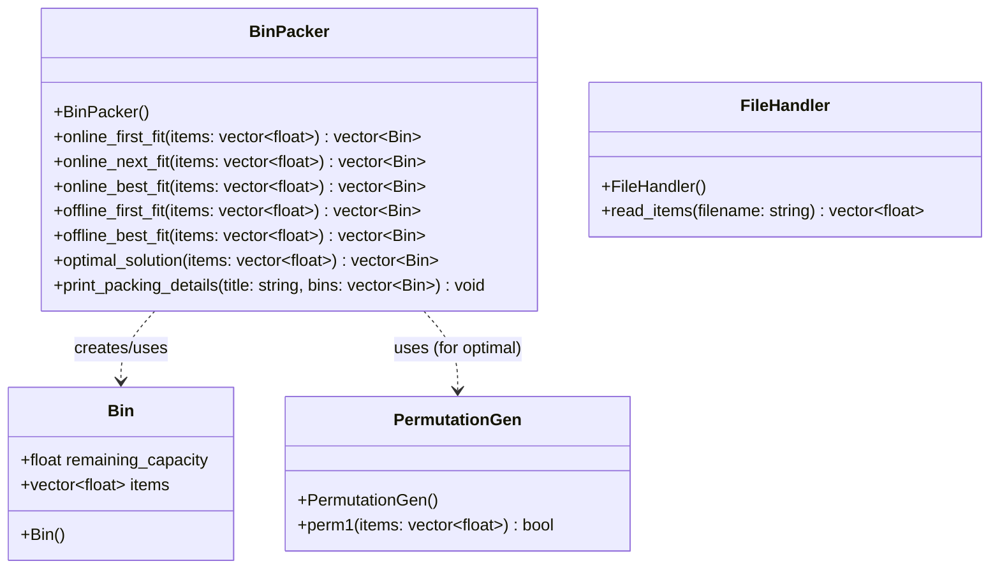

# UML Diagram

```mermaid
classDiagram
    class Bin {
        +float remaining_capacity
        +vector~float~ items
        +Bin()
    }

    class BinPacker {
        +BinPacker()
        +online_first_fit(items: vector~float~) vector~Bin~
        +online_next_fit(items: vector~float~) vector~Bin~
        +online_best_fit(items: vector~float~) vector~Bin~
        +offline_first_fit(items: vector~float~) vector~Bin~
        +offline_best_fit(items: vector~float~) vector~Bin~
        +optimal_solution(items: vector~float~) vector~Bin~
        +print_packing_details(title: string, bins: vector~Bin~) void
    }

    class FileHandler {
        +FileHandler()
        +read_items(filename: string) vector~float~
    }

    class PermutationGen {
        +PermutationGen()
        +perm1(items: vector~float~) bool
    }

    BinPacker ..> Bin : creates/uses
    BinPacker ..> PermutationGen : uses (for optimal)
```
